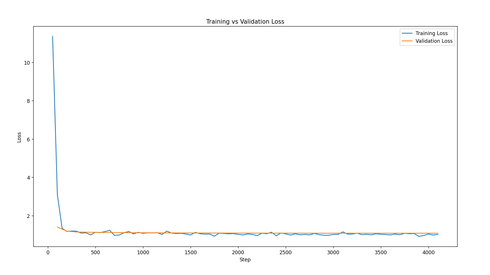

# 🧠 Finance Analyst

> A domain-specialized Finance Q&A Agent combining LoRA fine-tuned Qwen2.5-3B with RAG for context-grounded, reliable financial insights.
⚙️ Fine-tuning is optional — pre-trained LoRA weights will be automatically downloaded when you run the RAG assistant.

[](https://www.python.org/downloads/)
[](LICENSE)
[](https://huggingface.co/Qwen)

---

## 📋 Overview

This project delivers an intelligent financial assistant that classifies finance-related questions, retrieves real-time financial data from curated sources, and generates expert-level summaries using state-of-the-art NLP techniques.

### Key Capabilities

- 🎯 **Domain Classification** — Filters non-finance queries automatically
- 📚 **RAG Pipeline** — Retrieves and reranks relevant financial documents
- 🤖 **Fine-tuned LLM** — Qwen2.5-3B optimized for financial Q&A
- ⚡ **Efficient Inference** — 4-bit quantization for fast responses
- 🔍 **Smart Retrieval** — Multi-query expansion for better recall

---

## 🚀 Features

| Feature | Description |
|---------|-------------|
| **Fine-tuned Model** | Qwen2.5-3B trained on Dolly, FIQA, and synthetic finance datasets using LoRA |
| **Quantized Inference** | 4-bit quantization for efficient deployment |
| **Advanced RAG** | Chroma vectorstore + Cross-Encoder reranking |
| **Query Expansion** | Contextual multi-query generation for improved retrieval |
| **Domain Filtering** | Automatic classification of finance-related questions |
| **Clean Output** | Post-processed responses trimmed to 3 concise sentences |
| **Interactive CLI** | User-friendly command-line interface |

---

## 🏗️ Architecture

```
┌─────────────────────────────┐
│  User Question (Finance?)   │
└──────────────┬──────────────┘
               │
    Yes        ▼
   ┌────────────────────┐
   │ Multi-Query Expander│
   └────────────┬────────┘
                ▼
 ┌────────────────────────────┐
 │ Web + Stock Retriever (RAG)│
 └────────────┬───────────────┘
              ▼
   ┌────────────────────────┐
   │ Fine-Tuned Qwen2.5 LLM │
   └────────────┬───────────┘
                ▼
         Final Answer
```

---

## 🧩 Components

### 1. Fine-Tuning (LoRA)

**Model Configuration:**
- Base Model: `Qwen2.5-3B`
- Quantization: 4-bit (bnb_4bit_compute_dtype=float16)
- LoRA Parameters: r=16, alpha=32
- Target Modules: `['q_proj', 'v_proj']`

```python
trainer.train()
results = trainer.evaluate()
print("Perplexity:", math.exp(results["eval_loss"]))
```

**Training Performance:**
- ✅ Smooth convergence with stable loss reduction
- ✅ Final Perplexity: **2.95**

### 2. Training Data

**Fine-tuning Dataset:**
- 🧾 **Dolly 15k** — Instruction-based dialogue
- 💰 **FIQA** — Financial sentiment + Q&A
- 🧠 **Synthetic Finance QA** — GPT-4 style templates

**RAG Corpus:**
- 📊 CSV-based stock data (Apple, Tesla, etc.)
- 🌐 Curated finance URLs:
  - Investopedia (ETF, compound interest, inflation, credit score)
  - Federal Reserve policy pages
  - Kiplinger (investing mistakes)
  - Tax awareness and Fed meeting summaries

### 3. Retrieval System (RAG)

| Component | Technology |
|-----------|------------|
| **Embeddings** | all-MiniLM-L6-v2 |
| **Vectorstore** | Chroma (persistent) |
| **Reranker** | cross-encoder/ms-marco-TinyBERT-L-2-v2 |
| **Chunking** | 1000 chars per chunk, 100 overlap |
| **Enhancement** | Multi-query expansion for semantic recall |

### 4. Finance Classification

Every question is validated before processing:

```
You are a financial domain classifier.
Classify the following question as 'finance' or 'not'.
```

**Response for non-finance queries:**
> "I can only answer finance-related questions."

### 5. Post-Processing

- Outputs trimmed to **3 concise sentences**
- Cleaned from verbose model artifacts
- Structured and readable format

---

## 💻 Example Usage

```bash
Finance Analyst ready. Type 'exit' to quit

Enter your question: What could be the market impact if President Trump fires Fed Chair Jerome Powell?

=== Final Answer ===
The market impact of firing Fed Chair Jerome Powell could be significant, 
potentially wiping out $1.5 trillion from the stock market...

Enter your question: Who is Cristiano Ronaldo?
I can only answer finance related questions.

Enter your question: What are the stock prices of apple?

=== Final Answer ===
Apple's stock price is $231.83 USD. It has a P/E ratio of 30.3 and a 
market capitalization of $3010.0 billion USD.
```

---

## ⚙️ Installation & Setup

### Prerequisites
- Python 3.8+
- CUDA-compatible GPU (recommended)
- 8GB+ RAM

### Quick Start

**1. Clone the Repository**
```bash
git clone https://github.com/prasunbhattarai/finance-llm-analyst.git

```

**2. Install Dependencies**
```bash
pip install -r requirements.txt
```

**3. Fine-tune the Model**
```bash
First:
python src/fine_tuning/preprocessing.py 
Then:
python src/fine_tuning/train.py 
```

**4. Run the RAG Assistant**
```bash
python main.py 
```

---

## 📊 Evaluation Results

### Model Performance

| Metric | Value |
|--------|-------|
| **Perplexity** | 2.95 |
| **Initial Loss** | 11.3 |
| **Final Loss** | 1.08 |
| **Convergence** | ✅ Stable |
| **Overfitting** | ❌ None observed |

### Training Behavior

The training and validation loss curves demonstrate excellent convergence:

- 📉 **Rapid initial learning** — Loss drops significantly in first few hundred steps
- 📊 **Stable plateau** — Consistent performance after convergence
- 🎯 **Validation tracking** — Val loss closely follows training loss
- ✅ **Strong generalization** — Model adapts well to financial instruction domain

<div align="center">
  
  <p><i>Training and validation loss showing smooth convergence</i></p>
</div>

---

## 🔮 Future Enhancements

### 🧩 Fine-tuning Improvements
- [ ] Incorporate larger financial corpora (EDGAR filings, SEC 10-K, financial news)
- [ ] Apply LoRA rank search or QLoRA for memory-efficient multi-domain tuning
- [ ] Introduce instruction-following refinement with expert Q&A datasets

### 🌐 RAG & Knowledge Expansion
- [ ] Add trusted sources: Bloomberg, Yahoo Finance, IMF, World Bank, CNBC
- [ ] Integrate live data APIs for real-time market updates
- [ ] Implement hybrid retrieval (vector + keyword BM25)

### 🧠 Pipeline Intelligence
- [ ] Add reasoning feedback loops for factual consistency
- [ ] Implement memory caching for prior user sessions
- [ ] Evaluate on benchmark datasets (FinancialQA, BankExamQA)
- [ ] Multi-language support for global markets

---

## 🤝 Contributing

Contributions are welcome! Please feel free to submit a Pull Request. For major changes, please open an issue first to discuss what you would like to change.

---

## 📄 License

This project is licensed under the MIT License - see the [LICENSE](LICENSE) file for details.

---

## 🙏 Acknowledgments

- **Qwen Team** for the base model
- **Hugging Face** for transformers and PEFT libraries
- **LangChain** for RAG orchestration
- Financial data providers and open-source datasets

---

## 📞 Contact

For questions or feedback, please open an issue or reach out to the maintainers.

---
